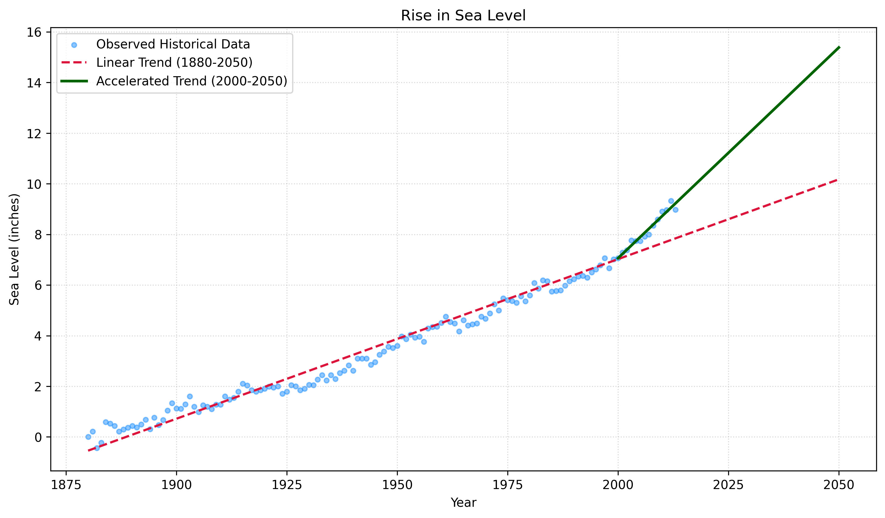

# Global-Sea-Level-Predictor
​A predictive modeling pipeline analyzing 130+ years of climate metrics to quantify acceleration in global sea level rise, providing critical trend forecasts up to 2050 for coastal risk assessment and infrastructure planning.

# Quantifying Coastal Risk: Dual-Horizon Sea Level Forecasting to 2050

[](https://opensource.org/licenses/MIT)
[](https://www.python.org/)
[](https://plotly.com/)

## 🌎 Executive Summary & Real-World Utility
Global logistics hubs, coastal civil infrastructure, and multi-billion-dollar real estate portfolios rely heavily on precise climate metrics to allocate defensive capital. Municipal engineering tolerances and regional zoning laws must be calibrated against accurate projections to prevent catastrophic structural failures by mid-century.

This analytics pipeline ingests over 130 years of global absolute sea level metrics to mathematically evaluate the **Climate Acceleration Hypothesis**. Rather than treating historical data as a uniform sequence, this model isolates distinct historical windows to expose structural shifts in the velocity of sea level rise—providing actionable forecasting data for urban planners and risk management stakeholders up to the year **2050**.

### The Analytical Takeaway
* **The Baseline Flaw:** Models utilizing the entire century-scale dataset calculate a predictable, moderate trajectory. 
* **The Accelerated Reality:** Restricting the modeling matrix strictly to data points from the year 2000 onward reveals an aggressively steeper trajectory. 
* **The Operational Impact:** **The rate of sea level rise in the modern era is more than double the long-term historical baseline.** Engineering firms and municipalities that design coastal defenses using 100-year averages are actively under-engineering infrastructure and severely underestimating future risk profiles.

---

## 📊 Visualized Predictions

Below is the generated statistical chart mapping the historical observations alongside the dual-horizon linear forecasting trajectories up to 2050:



*The divergence between the dashed red line (Historical Trend) and the solid green line (Modern Accelerated Trend) visually quantifies the rapid acceleration shift occurring at the turn of the century.*

---

## 🛠️ Pipeline Architecture & Tech Stack

This project implements a decoupled architecture separating data loading, statistical regression computing, and visualization rendering blocks:

* **Vector Masking (`Pandas`):** Ingests raw CSV streams dynamically and applies high-performance conditional masking to isolate custom historical epochs without damaging source integrity.
* **Predictive Modeling (`SciPy Stats`):** Executes ordinary least squares (OLS) linear regressions via `linregress` to determine predictive trend parameters (slope, intercept, and statistical confidence values).
* **Dual-Delivery Visuals (`Matplotlib` & `Plotly`):** Generates strict static layout assertions optimized for automated test verification suites, alongside a dynamic, touch-optimized graphical interactive engine built for cross-platform stakeholder reviews.

---

## 🚀 How to Run and Reproduce Locally

### 1. Prerequisites & Dependencies
Ensure you have Python installed, then clone the repository and install the production package pinning requirements:
```bash
git clone [https://github.com/Val-The-Analyst/sea-level-predictor.git](https://github.com/Val-The-Analyst/sea-level-predictor.git)
cd sea-level-predictor
pip install -r requirements.txt
---

## 📈 Personal Analytical Discoveries

The core utility of this project lies in its comparative framework. By separating the historical timeline into two distinct horizons, the pipeline uncovers a critical discrepancy that standard aggregate models completely miss:

### The Analytical Takeaway
* **The Baseline Flaw:** Models utilizing the entire century-scale dataset calculate a predictable, moderate trajectory. 
* **The Accelerated Reality:** Restricting the modeling matrix strictly to data points from the year 2000 onward reveals an aggressively steeper trajectory. 
* **The Operational Impact:** **The rate of sea level rise in the modern era is more than double the long-term historical baseline.** Engineering firms and municipalities that design coastal defenses using 100-year averages are actively under-engineering infrastructure and severely underestimating future risk 
